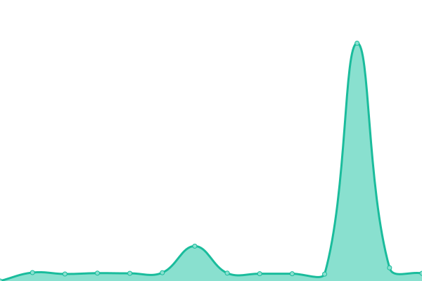

# [📈 Live Status](https://cyp0633.github.io/uptime-monitor): <!--live status--> **🟧 Partial outage**

This repository contains the open-source uptime monitor and status page for [Yupeng Chen](cyp0633.icu), powered by [Upptime](https://github.com/upptime/upptime).

With [Upptime](https://upptime.js.org), you can get your own unlimited and free uptime monitor and status page, powered entirely by a GitHub repository. We use [Issues](https://github.com/cyp0633/uptime-monitor/issues) as incident reports, [Actions](https://github.com/cyp0633/uptime-monitor/actions) as uptime monitors, and [Pages](https://cyp0633.github.io/uptime-monitor) for the status page.

<!--start: status pages-->
<!-- This summary is generated by Upptime (https://github.com/upptime/upptime) -->
<!-- Do not edit this manually, your changes will be overwritten -->
<!-- prettier-ignore -->
| URL | Status | History | Response Time | Uptime |
| --- | ------ | ------- | ------------- | ------ |
|  [blog](https://cyp0633.icu) | 🟩 Up | [blog.yml](https://github.com/cyp0633/uptime-monitor/commits/HEAD/history/blog.yml) | 

 1430ms
     
 | 

<a href="https://status.cyp0633.icu/history/blog">100.00%</a>
    

|  [GitHub proxy](https://gh.cyp0633.icu) | 🟩 Up | [git-hub-proxy.yml](https://github.com/cyp0633/uptime-monitor/commits/HEAD/history/git-hub-proxy.yml) | 

 775ms
     
 | 

<a href="https://status.cyp0633.icu/history/git-hub-proxy">100.00%</a>
    

|  [Gitea](https://git.cyp0633.icu) | 🟩 Up | [gitea.yml](https://github.com/cyp0633/uptime-monitor/commits/HEAD/history/gitea.yml) | 

 923ms
     
 | 

<a href="https://status.cyp0633.icu/history/gitea">100.00%</a>
    

|  [Cloudreve](https://drive.cyp0633.icu) | 🟩 Up | [cloudreve.yml](https://github.com/cyp0633/uptime-monitor/commits/HEAD/history/cloudreve.yml) | 

 802ms
     
 | 

<a href="https://status.cyp0633.icu/history/cloudreve">100.00%</a>
    

|  [Vaultwarden](https://warden.cyp0633.icu) | 🟩 Up | [vaultwarden.yml](https://github.com/cyp0633/uptime-monitor/commits/HEAD/history/vaultwarden.yml) | 

 386ms
     
 | 

<a href="https://status.cyp0633.icu/history/vaultwarden">100.00%</a>
    

|  [FRP](https://code.cyp0633.icu/frp/static/#/) | 🟥 Down | [frp.yml](https://github.com/cyp0633/uptime-monitor/commits/HEAD/history/frp.yml) | 

 651ms
     
 | 

<a href="https://status.cyp0633.icu/history/frp">44.01%</a>
    

<!--end: status pages-->

[**Visit our status website →**](https://cyp0633.github.io/uptime-monitor)

## 📄 License

- Powered by: [Upptime](https://github.com/upptime/upptime)
- Code: [MIT](./LICENSE) © [Yupeng Chen](cyp0633.icu)
- Data in the `./history` directory: [Open Database License](https://opendatacommons.org/licenses/odbl/1-0/)
